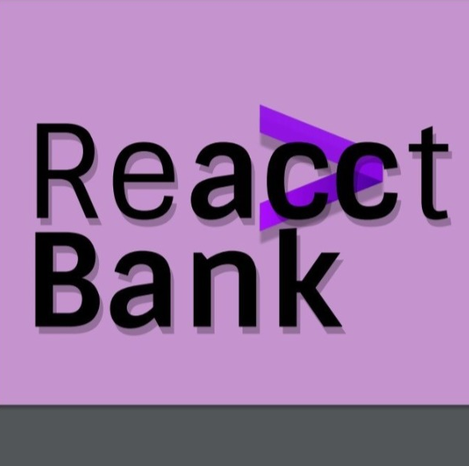

<br />
<p align="center">
  <a href="#">
    
  </a>

  <h3 align="center">Gama Bank - ReacctBank</h3>

  <p align="center">
    Projeto de React feito durante o bootcamp da Accenture Academy
    <br />
    <br />
     <a href="https://gamabank.netlify.app/">Você pode acessar o projeto clicando aqui!</a>
  </p>
</p>

<details open="open">
  <summary>Tabela de conteúdo</summary>
  <ol>
    <li>
      <a href="#about-the-project"> o o Projeto</a>
      <ul>
        <li><a href="#built-with">Feito com..</a></li>
          <li><a href="#mindmap">MindMap</a></li>
          <li><a href='#projectstructure'>Estrutura de Pastas</a></li>
      </ul>
    </li>
    <li>
      <a href="#getting-started">Começando</a>
      <ul>
        <li><a href="#prerequisites">Pré-requisitos</a></li>
        <li><a href="#installation">Instalação</a></li>
      </ul>
    </li>
    <li><a href="#contact">Contato</a></li>
    <li><a href="#acknowledgements">Agradecimentos</a></li>
  </ol>
</details>
<div id='about-the-project'></div>

## Sobre o Projeto


Gama Bank foi realizado durante a Accademia Accenture, programa de capacitação voltado para programadores das áreas de Front End (Angular, React), Mobile (React Native), Back End (Java e Node.js) e Dados (Data Engineer). Ao todo, 220 pessoas foram treinadas pela Gama Academy, uma das principais escolas de capacitação no mercado digital do País.

Este projeto foi realizado por João Pedro, Bruno, Christian e Gustavo, estduantes da turma de React Native, que juntos formam o grupo Reacct Bank

A aplicação web consiste em um serviço de banco digital fícticio, que possibilita o usuário a criar conta, fazer lançamentos, transações, transfêrencias e mudar planos através da [Gama Educação - API](https://accenture-java-desafio.herokuapp.com/).

<div id='built-with'></div>

### Feito com:

- [React](https://reactnative.dev/)
- [Redux](https://redux.js.org/)
- [Axios](https://github.com/axios/axios)
- [Typescript](https://www.typescriptlang.org/)
- [Styled Components](https://styled-components.com/)
- [Yup](https://github.com/jquense/yup)
- [React-toastify](https://fkhadra.github.io/react-toastify/introduction)

<div id='mindmap'></div>

### MindMap

[Acesse aqui!](https://miro.com/app/board/o9J_lS43pUM=/)

<div id='projectstructure'></div>

### Estrutura do projeto

```
React Bank
│
└───public
└───src
│   └───__tests__
│   │      └───views
│   │          └───components
│   │          └───pages
│   └───assets
│   │       icons
│   │       images
│   └───routes
│   └───services
│   └───store
│   │    └───modules
│   │    │   └───user
│   │    └───index.ts
│   └───styles
│   └───types
│   └───utils
│   │    └───validations
│   └───views
│   │    └───components
│   │    └───pages
│   └───App.tsx
│   │
│   └───index.tsx
└───package.json
└───  README.md
└───  tsconfig.json
```

<!-- GETTING STARTED -->

## Como Começar

### Pré requisitos

- npm
  ```sh
  npm install npm@latest -g
  ```

### Instalação

1. Clone o repositório
   ```sh
   git clone https://github.com/jpmmatias/reacctbank.git
   ```
2. Instale os NPM packages
   ```sh
   npm install ou yarn install
   ```
3. Abra o projeto
   ```sh
   npm run start ou yarn start
   ```

<!-- CONTACT -->

## Contatos

- [Bruno Lourenço](https://github.com/bruunos)
- [Christian Spinelli](https://github.com/ChristianSpinelli) - chris.spinelli93@gmail.com
- [Gustavo "Piá" de Moraes Xavier](https://github.com/piagja)
- [João Pedro Matias](https://github.com/jpmmatias) - jpmmatias@gmail.com

<!-- ACKNOWLEDGEMENTS -->

## Agradecimentos

Muito obrigado a todos que nos ajudaram durante o curso

- Professor Douglas Morais, nosso mestre
- Camila, nossa yellow belt
- Accenture, agradecemos pela oportunidade
- E a Gama Academy
